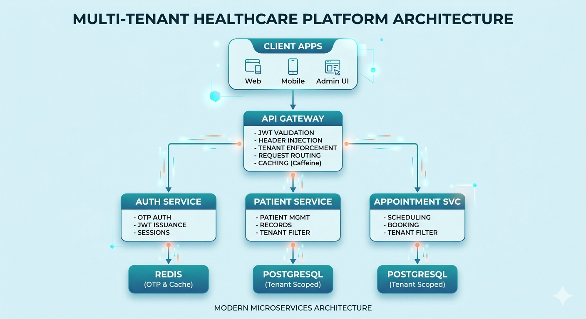

# Multi-Tenant Healthcare SaaS Platform

An API-first, microservices-based backend engineered for high-scale healthcare providers (hospitals, labs, and clinics). This platform is built with a "Security-by-Design" approach, ensuring strict tenant-level data isolation and high availability.

---

## 🏗 Architecture Overview
The system follows a **Hexagonal (Ports & Adapters) Architecture** to decouple domain logic from external infrastructure. 

### System Diagram
 
*Note: This diagram illustrates the flow from Client Apps through the API Gateway to tenant-scoped microservices.*

### Architectural Pillars:
* **Microservices Pattern:** Decoupled services communicating via gRPC for high-performance internal calls.
* **API Gateway Pattern:** Centralized entry point handling JWT validation, rate limiting, and **Tenant Header Injection**.
* **Domain-Driven Design (DDD):** Focused on clear bounded contexts (Auth, Patient, Appointment).

---

## 🛠 Tech Stack
* **Backend:** Java 17, Spring Boot 4, Spring WebFlux (Reactive Stack)
* **Database:** PostgreSQL (R2DBC for non-blocking I/O)
* **Caching:** Redis (Global Cache/OTP), Caffeine (Local Gateway Cache)
* **Communication:** gRPC, REST
* **Security:** JWT, OAuth2 principles, Argon2 Password Hashing

---

## 🌟 Key Engineering Highlights

### 🛡️ Robust Multi-Tenancy
Implemented a custom **Tenant Interceptor framework**. Every request is validated at the Gateway; the `tenantId` is injected into headers and enforced at the database layer (Row-Level Security/Schema isolation logic) to prevent cross-tenant data leakage.

### ⚡ High-Performance Gateway
The API Gateway utilizes **Caffeine Cache** to reduce latency for repetitive validation checks and **Spring WebFlux** to handle thousands of concurrent requests with minimal thread overhead.

### 🔐 Advanced Auth Flow
* **OTP-based Login:** Secure, passwordless entry points.
* **Claims-Based Access:** JWTs carry granular roles and tenant context to reduce database lookups in downstream services.
* **Audit Logging:** A centralized interceptor tracks all state changes (Who, What, When) for compliance.

---

## 📈 Scalability Design
The platform is built to handle:
* **1,000+ Isolated Tenants** without performance degradation.
* **Horizontal Scaling:** Stateless services ready for Kubernetes (K8s) orchestration.
* **Reactive Data Access:** Using R2DBC to maximize throughput during high-traffic periods (e.g., peak booking hours).

---

## 🛤 Roadmap & Future Enhancements
- [ ] **Event-Driven Architecture:** Implementing RabbitMQ/Kafka for asynchronous audit logging and notifications.
- [ ] **Observability:** Integrating Prometheus and Grafana for real-time service health monitoring.
- [ ] **Billing:** Stripe integration for a per-tenant subscription model.

---

## 👤 Author
**Emmanuel Achigbo** *Backend Engineer | Microservices & SaaS Specialist* [LinkedIn](your-linkedin-url) | [Portfolio](your-portfolio-url)
